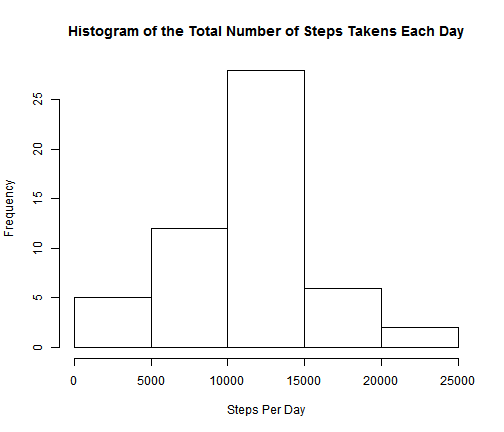
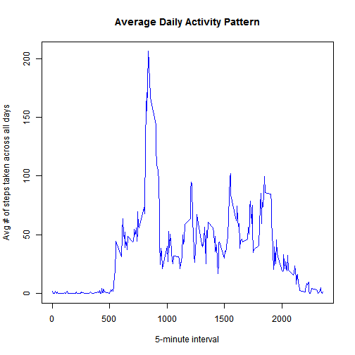

# Reproducible Research: Peer Assessment 1


## Loading and preprocessing the data
**Load the data (i.e. read.csv())**


```r
rm(list = ls())  #Clear all objects

# Load libraries
require(dplyr)
```

```
## Loading required package: dplyr
## 
## Attaching package: 'dplyr'
## 
## The following objects are masked from 'package:stats':
## 
##     filter, lag
## 
## The following objects are masked from 'package:base':
## 
##     intersect, setdiff, setequal, union
```

```r

# Set directory and file vectors
working.dir <- "C://Education//Reproducible Research//Homework//Peer Assessment 1"
input.dir <- ".\\input\\"
output.dir <- ".\\output\\"
script.dir <- ".\\scripts\\"
input.file.name <- "activity.csv"

# Set working directory
setwd(working.dir)

# Load the data
activity.data <- read.csv(paste(input.dir, input.file.name, sep = "\\"), stringsAsFactors = FALSE)
```

**Process/transform the data (if necessary) into a format suitable for your analysis**

```r
steps.per.day <- activity.data %.% filter(steps >= 0) %.% select(date, steps) %.% 
    group_by(date) %.% summarize(sum.steps = round(sum(steps), 1)) %.% arrange(date)
```


## What is mean total number of steps taken per day?
**Make a histogram of the total number of steps taken each day**


```r
hist(c(steps.per.day$sum.steps), main = "Histogram of the Total Number of Steps Takens Each Day", 
    xlab = "Steps Per Day")
```

 

**Calculate and report the mean total number of steps taken per day**

```r
round(mean(steps.per.day$sum.steps), 2)
```

```
## [1] 10766
```

**Calculate and report the median total number of steps taken per day**

```r
median(steps.per.day$sum.steps)
```

```
## [1] 10765
```


## What is the average daily activity pattern?
**Make a time series plot (i.e. type = "l") of the 5-minute interval (x-axis) and the average number of steps taken, averaged across all days (y-axis)**

```r
average.daily.pattern <- activity.data %.% filter(steps >= 0) %.% select(interval, 
    steps) %.% group_by(interval) %.% summarize(mean.steps = round(mean(steps), 
    1)) %.% arrange(interval)

plot(average.daily.pattern, type = "l", main = "Average Daily Activity Pattern", 
    xlab = "5-minute interval", ylab = "Avg # of steps taken across all days", 
    col = "blue")
```

 


## Imputing missing values
**Calculate and report the total number of missing values in the dataset (i.e. the total number of rows with NAs)**

```r
nrow(activity.data[is.na(activity.data$steps), ])
```

```
## [1] 2304
```

**Devise a strategy for filling in all of the missing values in the dataset. The strategy does not need to be sophisticated. For example, you could use the mean/median for that day, or the mean for that 5-minute interval, etc.**  

I will impute the missing values by using the mean for that 5-minute interval.
## Are there differences in activity patterns between weekdays and weekends?
