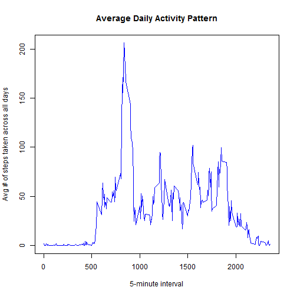

# Reproducible Research: Peer Assessment 1


## Loading and preprocessing the data
**Load the data (i.e. read.csv())**


```r
rm(list = ls())  #Clear all objects

# Load libraries
require(dplyr)
```

```
## Loading required package: dplyr
## 
## Attaching package: 'dplyr'
## 
## The following objects are masked from 'package:stats':
## 
##     filter, lag
## 
## The following objects are masked from 'package:base':
## 
##     intersect, setdiff, setequal, union
```

```r
require(quantmod)
```

```
## Loading required package: quantmod
## Loading required package: Defaults
## Loading required package: xts
## Loading required package: zoo
## 
## Attaching package: 'zoo'
## 
## The following objects are masked from 'package:base':
## 
##     as.Date, as.Date.numeric
## 
## 
## Attaching package: 'xts'
## 
## The following objects are masked from 'package:dplyr':
## 
##     first, last
## 
## Loading required package: TTR
## Version 0.4-0 included new data defaults. See ?getSymbols.
```

```r
require(lattice)
```

```
## Loading required package: lattice
```

```r

# Set directory and file vectors
working.dir <- "C://Education//Reproducible Research//Homework//Peer Assessment 1"
input.dir <- ".\\input\\"
output.dir <- ".\\output\\"
script.dir <- ".\\scripts\\"
input.file.name <- "activity.csv"

# Set working directory
setwd(working.dir)

# Load the data
activity.data <- read.csv(paste(input.dir, input.file.name, sep = "\\"), stringsAsFactors = FALSE)
```

**Process/transform the data (if necessary) into a format suitable for your analysis**

```r
steps.per.day <- activity.data %.% filter(steps >= 0) %.% select(date, steps) %.% 
    group_by(date) %.% summarize(sum.steps = round(sum(steps), 1)) %.% arrange(date)
```


## What is mean total number of steps taken per day?
**Make a histogram of the total number of steps taken each day**


```r
hist(c(steps.per.day$sum.steps), main = "Histogram of the Total Number of Steps Takens Each Day", 
    xlab = "Steps Per Day")
```

 

**Calculate and report the mean total number of steps taken per day**

```r
options(scipen = 1, digits = 7)
round(mean(steps.per.day$sum.steps), 2)
```

```
## [1] 10766.19
```

**Calculate and report the median total number of steps taken per day**

```r
options(scipen = 1, digits = 7)
median(steps.per.day$sum.steps)
```

```
## [1] 10765
```


## What is the average daily activity pattern?
**Make a time series plot (i.e. type = "l") of the 5-minute interval (x-axis) and the average number of steps taken, averaged across all days (y-axis)**

```r
average.daily.pattern <- activity.data %.% filter(steps >= 0) %.% select(interval, 
    steps) %.% group_by(interval) %.% summarize(mean.steps = round(mean(steps), 
    1)) %.% arrange(interval)

plot(average.daily.pattern, type = "l", main = "Average Daily Activity Pattern", 
    xlab = "5-minute interval", ylab = "Avg # of steps taken across all days", 
    col = "blue")
```

 


## Imputing missing values
**Calculate and report the total number of missing values in the dataset (i.e. the total number of rows with NAs)**

```r
nrow(activity.data[is.na(activity.data$steps), ])
```

```
## [1] 2304
```

**Devise a strategy for filling in all of the missing values in the dataset. The strategy does not need to be sophisticated. For example, you could use the mean/median for that day, or the mean for that 5-minute interval, etc.**  

I will impute the missing values by using the mean for that 5-minute interval.

**Create a new dataset that is equal to the original dataset but with the missing data filled in.**  

```r
activity.data.non.na <- filter(activity.data, is.na(steps) == FALSE)
activity.data.na <- filter(activity.data, is.na(steps) == TRUE)
temp <- inner_join(average.daily.pattern, activity.data.na, by = c("interval"))
activity.data.new <- rbind(activity.data.non.na, select(temp, steps = mean.steps, 
    date, interval))
```

**Make a histogram of the total number of steps taken each day v2**  

```r
steps.per.day.v2 <- activity.data.new %.% # filter(steps >= 0) %.%
select(date, steps) %.% group_by(date) %.% summarize(sum.steps = round(sum(steps), 
    1)) %.% arrange(date)
```


```r
hist(c(steps.per.day.v2$sum.steps), main = "Histogram of the Total Number of Steps Takens Each Day v2", 
    xlab = "Steps Per Day")
```

 

**Calculate and report the mean total number of steps taken per day v2**

```r
options(scipen = 1, digits = 7)
round(mean(steps.per.day.v2$sum.steps), 2)
```

```
## [1] 10766.19
```

**Calculate and report the median total number of steps taken per day v2**

```r
options(scipen = 1, digits = 7)
round(median(steps.per.day.v2$sum.steps), 2)
```

```
## [1] 10766.2
```

**Do these values differ from the estimates from the first part of the assignment?**
The mean stays the same while the median increases slightly (i.e. 0.01%) from the first part of the assignment.

**What is the impact of imputing missing data on the estimates of the total daily number of steps?**  

```r
options(scipen = 1, digits = 1)
total.daily.steps.1 <- round(summarize(steps.per.day, steps = sum(sum.steps)), 
    2)
total.daily.steps.2 <- round(summarize(steps.per.day.v2, steps = sum(sum.steps)), 
    2)
delta <- Delt(total.daily.steps.1[, c("steps")], total.daily.steps.2[, c("steps")]) * 
    100
```

**The impact of imputing missing data on the estimates of the total daily number of steps is to increase the total daily steps from 5.7 &times; 10<sup>5</sup> to 6.6 &times; 10<sup>5</sup> (i.e. 15.1%.)**

## Are there differences in activity patterns between weekdays and weekends?  
**Create a new factor variable in the dataset with two levels - "weekday" and "weekend" indicating whether a given date is a weekday or weekend day.**  

```r
activity.data.new <- mutate(activity.data.new, weekday.text = weekdays(as.Date(activity.data.new$date)), 
    weekday.text.baseline = weekdays(as.Date(activity.data.new$date)))
activity.data.new[activity.data.new$weekday.text == "Saturday" | activity.data.new$weekday.text == 
    "Sunday", c("weekday.text")] <- "weekend"
activity.data.new[activity.data.new$weekday.text != "weekend", c("weekday.text")] <- "weekday"
activity.data.new$weekday.text <- as.factor(activity.data.new$weekday.text)
```


**Make a panel plot containing a time series plot (i.e. type = "l") of the 5-minute interval (x-axis) and the average number of steps taken, averaged across all weekday days or weekend days (y-axis).**  

```r
average.daily.pattern.new <- activity.data.new %.% # filter(steps >= 0) %.%
select(interval, steps, weekday.text) %.% group_by(interval, weekday.text) %.% 
    summarize(mean.steps = round(mean(steps), 1)) %.% arrange(interval)

xyplot(average.daily.pattern.new$mean.steps ~ average.daily.pattern.new$interval | 
    average.daily.pattern.new$weekday.text, data = average.daily.pattern.new, 
    type = "l", layout = c(1, 2), xlab = "Interval", ylab = "Number of steps")
```

 

